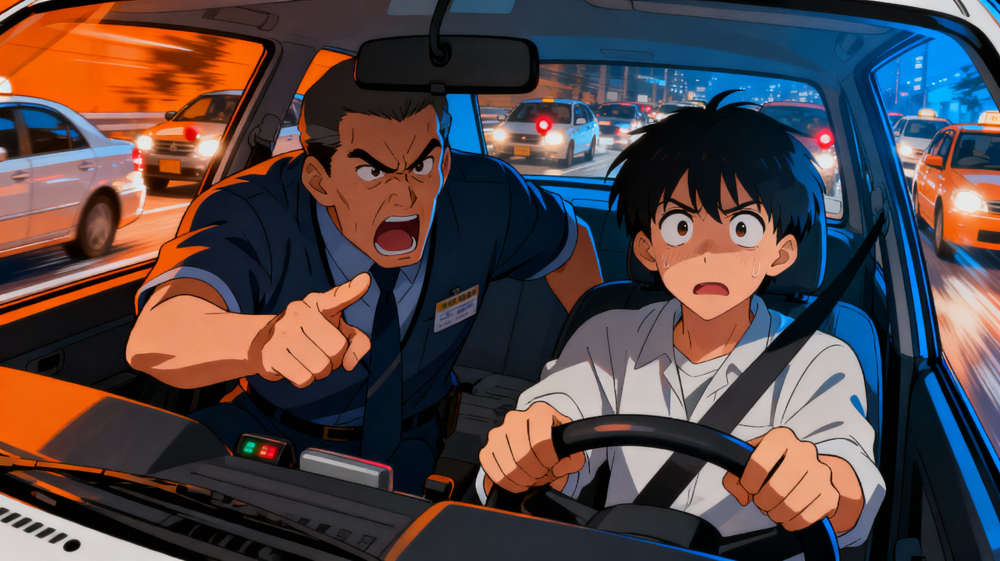
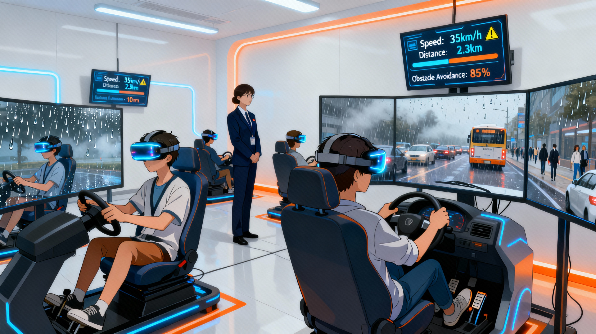
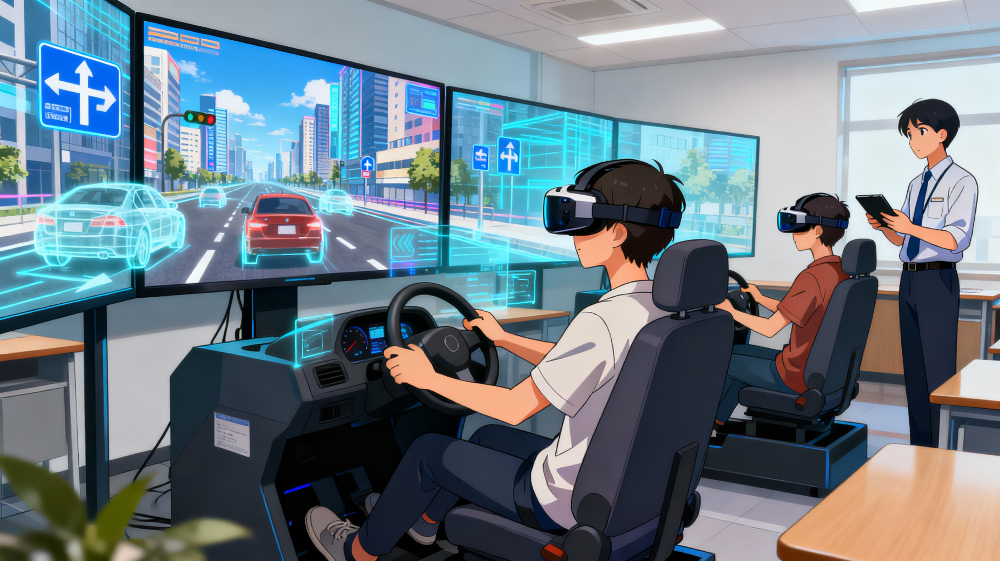

# 🚗 DriveXR — Immersive VR Driving Training Platform  

**DriveXR** is a Virtual Reality (VR) driving simulator designed to make road safety education **immersive, data-driven, and experiential**.  
It enables learners to **practice driving in realistic virtual environments**, experience diverse weather and traffic conditions, and receive AI-powered feedback — all without the risks of real-world mistakes.  

> ✨ DriveXR transforms driver training into a safe, smart, and fully immersive learning experience.  

---

## 💭 The Story – The Spark  

<table>
<tr>
<td width="50%" align="center" valign="middle">

</td>
<td width="60%" valign="top">

### 🛣️ The Observation  

While visiting driving schools and transport training centers, I noticed a recurring issue — learners were memorizing traffic signs but failing to *react correctly* in real-life scenarios.  
Training cars were limited, instructors were overburdened, and learners often faced anxiety during road practice.  

> When trainees encountered sudden rain or nighttime glare, panic replaced skill.  
> The problem wasn’t lack of knowledge — it was lack of experience.  

</td>
</tr>
</table>

---

<table>
<tr>
<td width="50%" align="center" valign="middle">

</td>
<td width="60%" valign="top">

### 💡 The Innovation  

That’s when I asked myself:  

> “What if learners could *drive through fog, rain, or heavy traffic* — safely?”  
> “What if driving schools could *track every learner’s mistakes and progress automatically*?”  

That question became the foundation of **DriveXR** —  
a virtual driving world where people learn by *experiencing* real roads, not just reading about them.  

</td>
</tr>
</table>

---

<table>
<tr>
<td width="50%" align="center" valign="middle">

</td>
<td width="60%" valign="top">

## ✨ Key Features  

- 🕹️ **Realistic Driving Simulations** — Practice on highways, city streets, and rural roads with lifelike traffic.  
- 🌦️ **Dynamic Weather & Time Modes** — Train under rain, fog, night, or bright sunlight for real-world readiness.  
- 🧠 **AI Instructor Feedback** — Get instant guidance and performance scores for braking, turning, and lane discipline.  
- 🚦 **Traffic Rule Training** — Learn and apply traffic laws through gamified missions and scenario-based exercises.  
- 🏆 **Progress Analytics Dashboard** — Visual reports for learners and instructors.  
- 🧍‍♂️ **Instructor Control Mode** — Trainers can set routes, challenges, and track real-time performance.  
- 🚘 **VR Hardware Integration** — Compatible with steering wheels, pedals, and VR headsets for true-to-life immersion.  

</td>
</tr>
</table>

---

## 🧩 Prototype Flow  

1. **Login & Role Selection** → Choose “Learner” or “Instructor.”  
2. **Driving Mode Selection** → City, Highway, Hill, or Test Course.  
3. **Immersion Mode** → Enter the VR environment and start driving simulation.  
4. **Scenario Challenge** → Face realistic traffic or weather conditions.  
5. **AI Feedback** → Real-time corrections for speed, lane use, and response time.  
6. **Report Summary** → Analytics and video playback of performance.  

> ## 🎮 Sample prototype demo: [Link](https://raguram-n.github.io/DriveXR/)

---

## 💡 Benefits  

- 🧠 **Improved Learning Retention** – Practice and feedback improve reaction and memory.  
- 🚦 **Enhanced Safety Awareness** – Learners experience risky conditions safely.  
- 📈 **Scalable Training** – Train hundreds of students without physical vehicles.  
- 💰 **Cost-Effective** – Reduces fuel, instructor, and maintenance costs.  
- 🧑‍🏫 **Data-Driven Insights** – Helps trainers identify weaknesses and personalize feedback.  
- 🌍 **Inclusive Learning** – Enables training for disabled learners or those in rural areas with limited infrastructure.  

---

## 🎯 Target Audience  

**DriveXR** is designed for driving schools, training institutes, transport authorities, and individuals who want to make driver education smarter, safer, and more measurable.  

<table>
<tr>
<td width="50%" align="center" valign="middle">

</td>
<td width="60%" valign="top">

### 🚗 Driving Schools & Training Centers  
- Provide VR-based learning before on-road sessions.  
- Reduce fuel and vehicle damage costs.  
- Monitor trainee progress digitally.  

### 🧑‍💼 Government Transport Departments  
- Integrate into RTO license training and testing modules.  
- Standardize training nationwide.  
- Use data analytics for safety campaigns.  

### 🏫 Educational Institutions  
- Introduce road safety training for students under NEP 2020.  
- Build awareness about responsible driving behavior.  

### 👨‍👩‍👧 Individual Learners  
- Prepare confidently before getting behind the wheel.  
- Practice real driving without risks or anxiety.  

</td>
</tr>
</table>

---

## 📊 Market Opportunity  

- 🌍 The **Driving Simulation Market** is projected to reach **$3.5 billion by 2030**, growing at **13% CAGR**.  
- 🥽 The **VR Automotive Training segment** is expanding with rapid adoption by transport institutions.  
- 🇮🇳 India records **150,000+ road fatalities annually** — highlighting the urgent need for skill-based driver education.  
- 🚘 With **20,000+ driving schools** across India, scalable VR training offers massive institutional potential.  
- 🏛️ Supported by **Digital India** and **Road Safety 2030** initiatives.  

> 🚦 DriveXR is not just a simulator — it’s a mission to create safer, smarter roads for everyone.  

---

## 💰 Revenue Opportunities  

<table>
<tr>
<td width="50%" align="center" valign="middle">

</td>
<td width="60%" valign="top">

### 1️⃣ B2B Model — Training Institute Partnerships  
- 🏫 **Annual Licensing per Branch** — Unlimited learner profiles and analytics dashboard.  
- 🪄 **Hardware Bundles** — Headset + steering wheel kits for plug-and-play setup.  
- 🧑‍🏫 **Instructor Certification Program** — Paid VR training pedagogy courses.  

### 2️⃣ B2G Model — Government Integration  
- 🚦 **RTO Training Modules** — Integration into learner license preparation programs.  
- 🇮🇳 **CSR Partnerships** — Safety programs under corporate responsibility initiatives.  
- 🚌 **Public Transport Training** — Driver training for government fleets and logistics.  

### 3️⃣ B2C Model — Direct-to-Consumer Subscriptions  
- 🎮 **DriveXR Mobile Edition (AR/VR)** — Smartphone-based learning experience.  
- 🏆 **Skill Challenges & Gamified Tests** — Premium leaderboard and certification features.  

### 4️⃣ Future Streams  
- 🤝 **OEM Collaborations** — Integrate VR modules with car manufacturers for demo/training.  
- 🧩 **Fleet Driver Analytics** — Subscription model for companies to monitor driver performance.  
- 🧠 **AI Simulation SDK** — White-label tech for other training platforms.  

</td>
</tr>
</table>

---

### 💹 Example Revenue Projection  

| Revenue Stream | Year 1 | Year 2 | Year 3 | Growth |
|----------------|--------|--------|--------|--------|
| Driving Schools | ₹25L | ₹75L | ₹1.5Cr | 200% |
| Government Contracts | ₹15L | ₹60L | ₹1.2Cr | 300% |
| Consumer Subscriptions | ₹10L | ₹30L | ₹70L | 233% |
| Partnerships & SDK | ₹5L | ₹20L | ₹50L | 150% |
| **Total Revenue** | **₹55L** | **₹1.85Cr** | **₹3.9Cr** | — |

> 💡 *DriveXR combines safety impact with scalable profitability — making driver education accessible, measurable, and future-ready.*  

---

## 🧰 Prototype Tech Stack  

| Layer | Tools / Technologies |
|-------|----------------------|
| **Design & Prototyping** | Figma, Blender, Adobe XD |
| **3D Development** | Unity 3D / Unreal Engine |
| **VR Integration** | Oculus SDK, WebXR API |
| **Backend** | Node.js, Firebase |
| **AI Instructor Engine** | TensorFlow, OpenAI API |
| **Telemetry & Analytics** | MongoDB, Grafana |
| **Hardware** | Logitech G29, Oculus Quest 2 |

---

<table>
<tr>
<td width="50%" align="center" valign="middle">

</td>
<td width="60%" valign="top">

## 🚀 Future Tech Scope  

- 🧠 **AI Behavioral Analysis** – Detect learner stress and driving habits.  
- 🌐 **Online Multiplayer Mode** – Simulated traffic with real learners driving together.  
- 🗣️ **Voice Commands & Gesture Control** – Natural user interaction in VR environment.  
- 🧩 **Integration with EV and Autonomous Training** – Future-proof simulation modules.  
- 📱 **AR Companion App** – Revision mode for mobile devices.  

---

## 🧭 Feature Enhancement Scope  

- 🎙️ **Instructor Voice Mode** – Real-time voice feedback during sessions.  
- 🧾 **Certification Dashboard** – Auto-generate learner progress certificates.  
- 🕹️ **Custom Scenarios** – Add city-specific traffic simulations.  
- 💫 **Offline Mode** – Training accessible without internet.  

</td>
</tr>
</table>

---

## 📈 Research Proof  

- [Road Safety and VR Simulation Effectiveness](https://github.com/Raguram-N/Road-Safety-and-VR-Simulation-Effectiveness/blob/main/README.md))  
- [How VR Reduces Driving Anxiety](https://github.com/Raguram-N/How-VR-Reduces-Driving-Anxiety/blob/main/README.md)  
- [Market Opportunity Report](https://github.com/Raguram-N/Market-Opportunity-Report/blob/main/README.md)  

---

## 🏁 Conclusion  

**DriveXR** bridges the gap between *driving theory* and *real-world experience*, giving learners the confidence and awareness to make roads safer for everyone.  
By merging **simulation, data analytics, and AI coaching**, DriveXR transforms driving education into a measurable, immersive, and life-saving experience.  

> “Safe drivers aren’t born on roads — they’re trained in experiences.”  

---

### ✍️ Author  
**RAGURAM NARAYANASWAMY**  
QA | UX Research | Growth Strategy | Product Management  

### 📂 Repo Purpose  
**Product Case Study & Growth Proposal for DriveXR — Immersive VR Driving Platform**  
